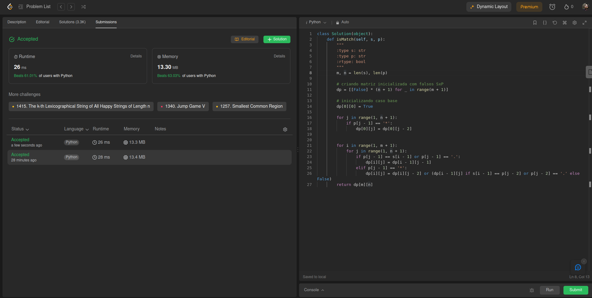
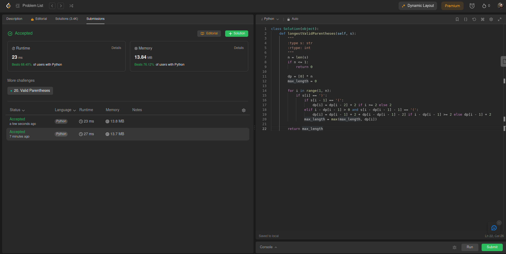
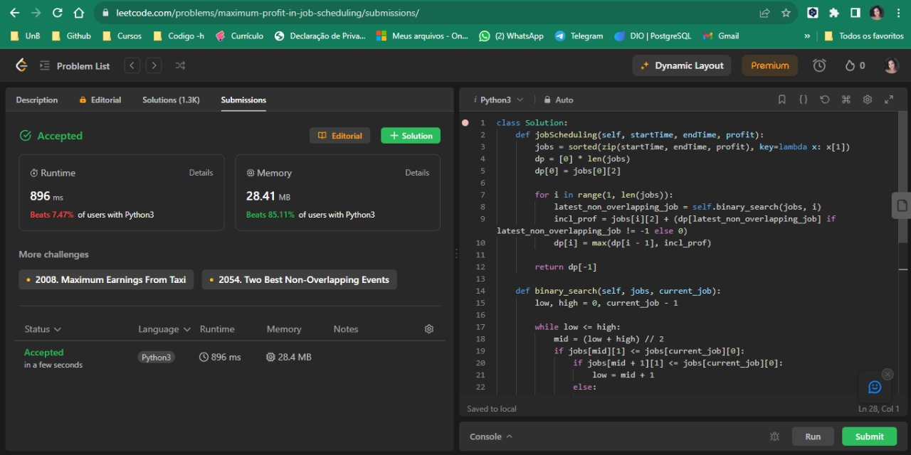

# ExerciciosDeJuizOnline

**Conteúdo da Disciplina**: Programação Dinâmica 

## Alunos
|Matrícula | Aluno |
| -- | -- |
| 20/0026046  |  Pedro de Oliveira Campos Barbosa |
| 20/2045268  |  Raquel Temóteo Eucaria Pereira da Costa |

## Exercícios Leet Code
|ID| Título      | Resposável | Nível |
|--|-------------|-------|-------|
|1 |[10. Regular Expression Matching](./exercicios/1.py) | Pedro     |Difícil|
|2 |[32. Longest Valid Parentheses](./exercicios/2.py)  | Pedro     |Difícil|
|3 |[1235. Maximum Profit in Job Scheduling](./exercicios/3.py)  | Raquel    |Difícil|

## Screenshots

### ✅ 1 - Regular Expression Matching
 

### ✅ 2 - Longest Valid Parentheses
 

### ✅ 3 -  Maximum Profit in Job Scheduling
 

## Instalação 
**Linguagem**: Python 

## Apresentação
Link da apresentação: [Clique aqui](./src/video.mp4).

